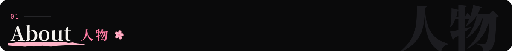
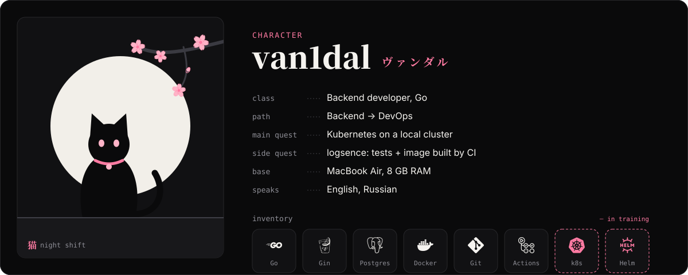
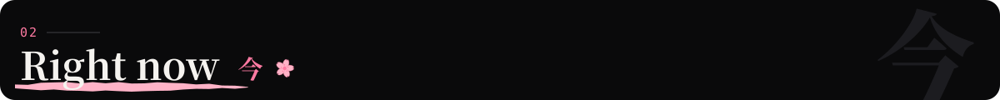
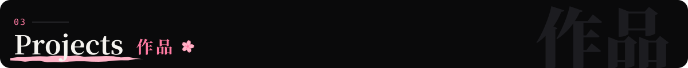
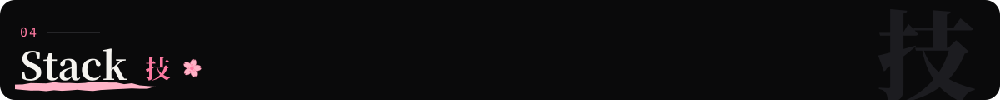
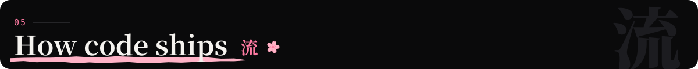
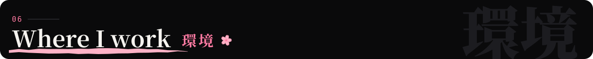
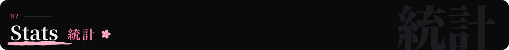
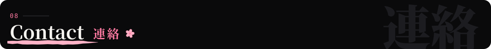

<picture><source media="(prefers-color-scheme: light)" srcset="assets/hero-light.svg"></picture>

<picture><source media="(prefers-color-scheme: light)" srcset="assets/h-about-light.svg"></picture>

<picture><source media="(prefers-color-scheme: light)" srcset="assets/about-light.svg"></picture>

I write **backend services in Go**: REST APIs on Gin, data in PostgreSQL, everything packed into **Docker**
and checked by **CI** on every push. The next chapter is **DevOps**: Kubernetes, infrastructure as code, the cloud.

I learn by shipping small, real things: a log collector, an uptime monitor, an orders API, a tiny HTTP framework,
a Telegram bot that talks to an LLM. Each one teaches me something the previous one didn't.

<picture><source media="(prefers-color-scheme: light)" srcset="assets/h-now-light.svg"></picture>

<picture><source media="(prefers-color-scheme: light)" srcset="assets/roadmap-light.svg"></picture>

- **Building** [logsence](https://github.com/van1dalgrr-arch/logsence): log ingestion and querying on Gin + PostgreSQL. Next: handler tests and a Docker image published by CI
- **Training** on Kubernetes in a local cluster (kubectl, Helm, k9s), then infrastructure as code with OpenTofu
- **Keeping** my whole dev environment in code: [dotfiles](https://github.com/van1dalgrr-arch/dotfiles). A clean Mac becomes my Mac in one command

<picture><source media="(prefers-color-scheme: light)" srcset="assets/h-projects-light.svg"></picture>

  <a href="https://github.com/van1dalgrr-arch/logsence"><picture><source media="(prefers-color-scheme: light)" srcset="assets/card-logsence-light.svg"></picture></a>
  <a href="https://github.com/van1dalgrr-arch/OrderGo"><picture><source media="(prefers-color-scheme: light)" srcset="assets/card-ordergo-light.svg"></picture></a>

  <a href="https://github.com/van1dalgrr-arch/watchdog"><picture><source media="(prefers-color-scheme: light)" srcset="assets/card-watchdog-light.svg"></picture></a>
  <a href="https://github.com/van1dalgrr-arch/Pulse"><picture><source media="(prefers-color-scheme: light)" srcset="assets/card-pulse-light.svg"></picture></a>

  <a href="https://github.com/van1dalgrr-arch/MINI-deploy"><picture><source media="(prefers-color-scheme: light)" srcset="assets/card-mini-deploy-light.svg"></picture></a>
  <a href="https://github.com/van1dalgrr-arch/NEXA-AI-BOT"><picture><source media="(prefers-color-scheme: light)" srcset="assets/card-nexa-light.svg"></picture></a>

<picture><source media="(prefers-color-scheme: light)" srcset="assets/h-stack-light.svg"></picture>

<picture><source media="(prefers-color-scheme: light)" srcset="assets/stack-light.svg"></picture>

<picture><source media="(prefers-color-scheme: light)" srcset="assets/h-ci-light.svg"></picture>

<picture><source media="(prefers-color-scheme: light)" srcset="assets/pipeline-light.svg"></picture>

Every Go repo rides the same line: it's the CI from
[logsence](https://github.com/van1dalgrr-arch/logsence/blob/main/.github/workflows/ci.yml), and new projects start with it through my `gonew` template.
Before a commit even leaves the laptop, **gitleaks** checks it for secrets.

<picture><source media="(prefers-color-scheme: light)" srcset="assets/h-desk-light.svg"></picture>

A MacBook Air with **8 GB of RAM**, so everything is tuned to stay light: **Ghostty** and **AeroSpace** tiling,
a hand-written zsh prompt, **Zed** with my own Dev Night / Dev Day themes (ported to GoLand too)
and **OrbStack** instead of Docker Desktop.

<a href="https://github.com/van1dalgrr-arch/dotfiles"><picture><source media="(prefers-color-scheme: light)" srcset="assets/dotfiles-light.svg"></picture></a>

<picture><source media="(prefers-color-scheme: light)" srcset="assets/h-stats-light.svg"></picture>

<picture><source media="(prefers-color-scheme: light)" srcset="https://raw.githubusercontent.com/van1dalgrr-arch/van1dalgrr-arch/output/stats-light.svg"></picture>

<picture><source media="(prefers-color-scheme: light)" srcset="https://raw.githubusercontent.com/van1dalgrr-arch/van1dalgrr-arch/output/snake-light.svg"></picture>

<picture><source media="(prefers-color-scheme: light)" srcset="assets/h-contact-light.svg"></picture>

  
  

Write in English or Russian.

<picture><source media="(prefers-color-scheme: light)" srcset="assets/footer-light.svg"></picture>

Every image here is an SVG drawn by [`scripts/build.py`](scripts/build.py), headlines in Noto Serif JP baked into paths.
Stats and the snake are redrawn daily by [a workflow](.github/workflows/profile.yml).
