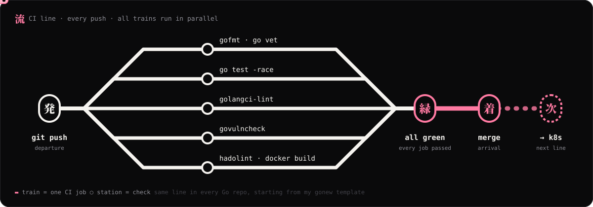

<picture>
  <source media="(prefers-color-scheme: light)" srcset="assets/banner-light.svg">
  
</picture>

 

I build **backend services in Go** (REST APIs on Gin with PostgreSQL), package them in **Docker**, and check
every push with **CI**. Now I'm moving further into **DevOps**: Kubernetes, infrastructure as code, cloud.

I learn by shipping small, real projects: a log collector, an uptime monitor, an orders API, a tiny HTTP framework,
a Telegram AI bot. Each one adds a skill I didn't have before.

 

## 🧭 Right now

- **Building** [logsence](https://github.com/van1dalgrr-arch/logsence): log ingestion and querying on Gin + PostgreSQL. Next up: handler tests and a Docker image published by CI
- **Learning** Kubernetes on a local cluster (kubectl, Helm, k9s), then infrastructure as code with OpenTofu
- **Keeping** my whole dev environment in code: [dotfiles](https://github.com/van1dalgrr-arch/dotfiles). A clean Mac becomes my Mac in one command

 

## 🛠️ Projects

### Go backend

<table>
<tr>
<td width="50%" valign="top">

#### [logsence](https://github.com/van1dalgrr-arch/logsence)
Log collection service: ingest logs over HTTP, store them in PostgreSQL, query them by service.

- Gin, **pgx + sqlx**, SQL **migrations**
- Multi-stage Docker image on Alpine, **non-root**, `HEALTHCHECK` that also pings the database
- Docker Compose for app + Postgres
- **CI**: gofmt, `go vet`, `go test -race`, golangci-lint, govulncheck, hadolint, Docker build

</td>
<td width="50%" valign="top">

#### [OrderGo](https://github.com/van1dalgrr-arch/OrderGo)
REST API for orders, built step by step toward a production layout.

- `cmd/` + `internal/` layering: config, domain, handler, repository, server
- PostgreSQL via `lib/pq`, YAML + `.env` config
- Docker and Docker Compose in `deploy/`, Makefile
- `/health` endpoint

</td>
</tr>
<tr>
<td width="50%" valign="top">

#### [watchdog](https://github.com/van1dalgrr-arch/watchdog)
Uptime monitor: polls a service's `/health` every 5 seconds and reports when it stops answering.

- Plain Go `net/http`, no framework
- Comes with a small test server to point it at
- Dockerized

</td>
<td width="50%" valign="top">

#### [Pulse](https://github.com/van1dalgrr-arch/Pulse)
A small HTTP framework for Go with its own API on top of Gin as the engine.

- Own `Context`: JSON, params, query, body binding, status
- Routing for GET / POST / PUT / DELETE
- Middleware chain

</td>
</tr>
<tr>
<td width="50%" valign="top">

#### [MINI-deploy](https://github.com/van1dalgrr-arch/MINI-deploy)
Deployment API for DevOps practice: accepts deploy requests, tracks them, exposes a health check.
Roadmap: Compose, CI/CD, deploy to Yandex Cloud.

</td>
<td width="50%" valign="top">

#### [NEXA AI](https://github.com/van1dalgrr-arch/NEXA-AI-BOT)
Telegram bot in Go that talks to an LLM through the **OpenRouter API**: `/start`, `/help`, `/about`
and free chat, with answers right in Telegram.

</td>
</tr>
</table>

### Also built

| Project | What | Stack |
|---|---|---|
| [Luma](https://github.com/van1dalgrr-arch/Luma) | AI assistant extension for VS Code: a chat sidebar and editor context | TypeScript, React webview, esbuild, tests |
| [UserForge](https://github.com/van1dalgrr-arch/UserForge) | User management REST API | Java 21, Spring Boot 4, multi-stage Docker with CDS and a healthcheck |
| [SpringBoot-Templates](https://github.com/van1dalgrr-arch/SpringBoot-Templates) | Starter for new Spring services: controller → service → repository | Java, Spring Boot, Maven |
| [dotfiles](https://github.com/van1dalgrr-arch/dotfiles) | My macOS dev environment as code (more below) | zsh, bash, Swift, GitHub Actions |

 

## 🧰 Skills

Sorted by how I actually use them, not by how good they look on a list.

<table>
<tr>
<th width="33%">Every day</th>
<th width="33%">In my projects</th>
<th width="33%">Learning now</th>
</tr>
<tr>
<td valign="top">

REST APIs, SQL, Compose, Makefiles, the terminal

</td>
<td valign="top">

migrations, govulncheck, hadolint, gitleaks, LLM APIs

</td>
<td valign="top">

local clusters (kind, OrbStack), observability

</td>
</tr>
</table>

 

## 🚢 How my code ships

Every Go project gets the same path from commit to image. It's the same CI that runs in
[logsence](https://github.com/van1dalgrr-arch/logsence/blob/main/.github/workflows/ci.yml),
and new projects start with it via my `gonew` template.

<picture>
  <source media="(prefers-color-scheme: light)" srcset="assets/pipeline-light.svg">
  
</picture>

Before a commit even leaves my laptop, **gitleaks** checks it for secrets in every repo.

 

## 💻 Where I work

A MacBook Air with **8 GB of RAM**, so everything is tuned to stay light:

- **Ghostty** + **AeroSpace** (tiling) + a hand-written zsh prompt: shell start in ~0.15 s
- **Zed** with my own themes, Dev Night and Dev Day (also ported to GoLand)
- **OrbStack** instead of Docker Desktop: memory is used only when containers run
- All of it in [dotfiles](https://github.com/van1dalgrr-arch/dotfiles): `bootstrap.sh` sets up a clean Mac,
  `dot doctor` checks that everything is in place, and CI tests the setup itself

 

## 📊 Stats

  
  

 

## 📫 Contact

Write in English or Russian.

Banner, layout and this README live in [van1dalgrr-arch/van1dalgrr-arch](https://github.com/van1dalgrr-arch/van1dalgrr-arch).
