<picture><source media="(prefers-color-scheme: light)" srcset="assets/hero-light.svg"></picture>

 

I build **backend services in Go** (REST APIs on Gin with PostgreSQL), package them in **Docker**, and check
every push with **CI**. Now I'm moving further into **DevOps**: Kubernetes, infrastructure as code, cloud.

I learn by shipping small, real projects: a log collector, an uptime monitor, an orders API, a tiny HTTP framework,
a Telegram AI bot. Each one adds a skill I didn't have before.

## 🧭 Right now

- **Building** [logsence](https://github.com/van1dalgrr-arch/logsence): log ingestion and querying on Gin + PostgreSQL. Next up: handler tests and a Docker image published by CI
- **Learning** Kubernetes on a local cluster (kubectl, Helm, k9s), then infrastructure as code with OpenTofu
- **Keeping** my whole dev environment in code: [dotfiles](https://github.com/van1dalgrr-arch/dotfiles). A clean Mac becomes my Mac in one command

<picture><source media="(prefers-color-scheme: light)" srcset="assets/roadmap-light.svg">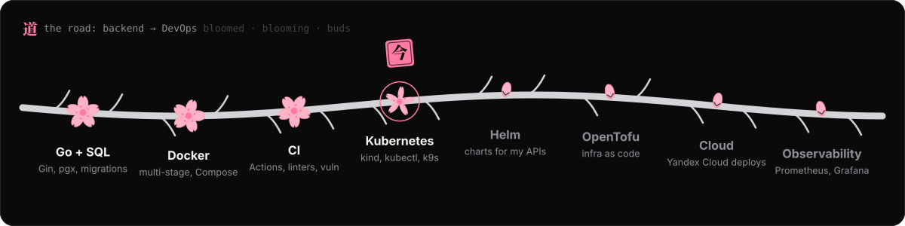</picture>

## 🛠️ Projects

Every card is a link. All of them are Go.

  <a href="https://github.com/van1dalgrr-arch/logsence"><picture><source media="(prefers-color-scheme: light)" srcset="assets/card-logsence-light.svg"></picture></a>
  <a href="https://github.com/van1dalgrr-arch/OrderGo"><picture><source media="(prefers-color-scheme: light)" srcset="assets/card-ordergo-light.svg">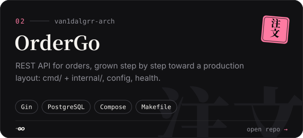</picture></a>

  <a href="https://github.com/van1dalgrr-arch/watchdog"><picture><source media="(prefers-color-scheme: light)" srcset="assets/card-watchdog-light.svg">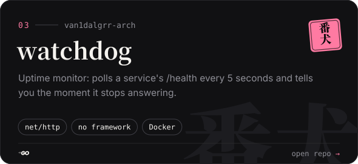</picture></a>
  <a href="https://github.com/van1dalgrr-arch/Pulse"><picture><source media="(prefers-color-scheme: light)" srcset="assets/card-pulse-light.svg">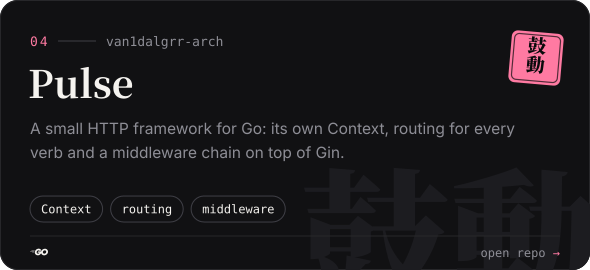</picture></a>

  <a href="https://github.com/van1dalgrr-arch/MINI-deploy"><picture><source media="(prefers-color-scheme: light)" srcset="assets/card-mini-deploy-light.svg">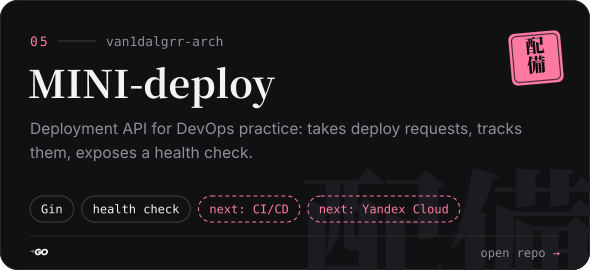</picture></a>
  <a href="https://github.com/van1dalgrr-arch/NEXA-AI-BOT"><picture><source media="(prefers-color-scheme: light)" srcset="assets/card-nexa-light.svg">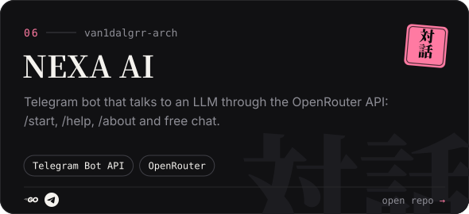</picture></a>

## 🧰 Stack

Sorted by how I actually use it, not by how good it looks on a list.

<picture><source media="(prefers-color-scheme: light)" srcset="assets/stack-light.svg">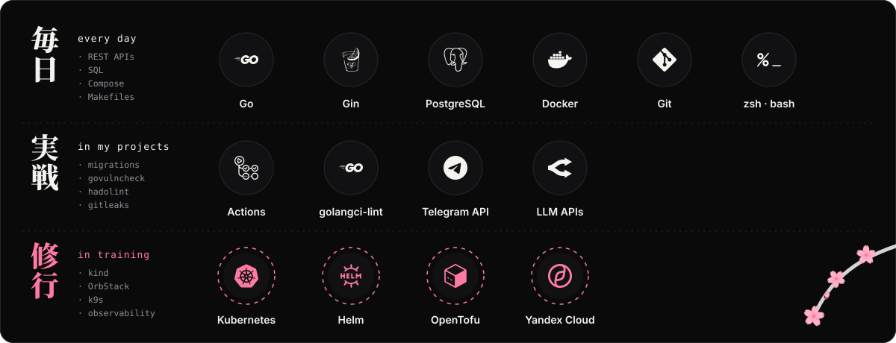</picture>

## 🚢 How my code ships

Every Go project gets the same path from commit to image. It's the same CI that runs in
[logsence](https://github.com/van1dalgrr-arch/logsence/blob/main/.github/workflows/ci.yml),
and new projects start with it via my `gonew` template.

<picture><source media="(prefers-color-scheme: light)" srcset="assets/pipeline-light.svg"></picture>

Before a commit even leaves my laptop, **gitleaks** checks it for secrets in every repo.

## 💻 Where I work

A MacBook Air with **8 GB of RAM**, so everything is tuned to stay light: **Ghostty** + **AeroSpace** tiling,
a hand-written zsh prompt, **Zed** with my own Dev Night / Dev Day themes (also ported to GoLand),
and **OrbStack** instead of Docker Desktop. All of it lives in dotfiles: `bootstrap.sh` sets up a clean Mac,
`dot doctor` checks that everything is in place, and CI tests the setup itself.

<a href="https://github.com/van1dalgrr-arch/dotfiles"><picture><source media="(prefers-color-scheme: light)" srcset="assets/dotfiles-light.svg">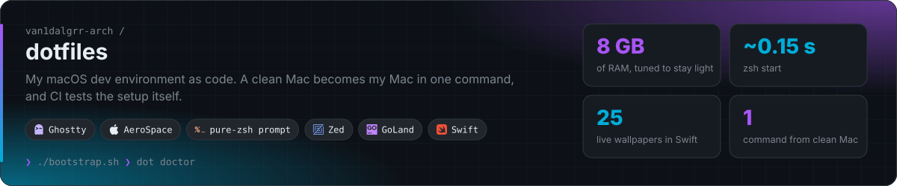</picture></a>

## 📊 Activity

<picture><source media="(prefers-color-scheme: light)" srcset="https://raw.githubusercontent.com/van1dalgrr-arch/van1dalgrr-arch/output/stats-light.svg"></picture>

<picture><source media="(prefers-color-scheme: light)" srcset="https://raw.githubusercontent.com/van1dalgrr-arch/van1dalgrr-arch/output/snake-light.svg"></picture>

## 📫 Contact

Write in English or Russian.

<picture><source media="(prefers-color-scheme: light)" srcset="assets/footer-light.svg">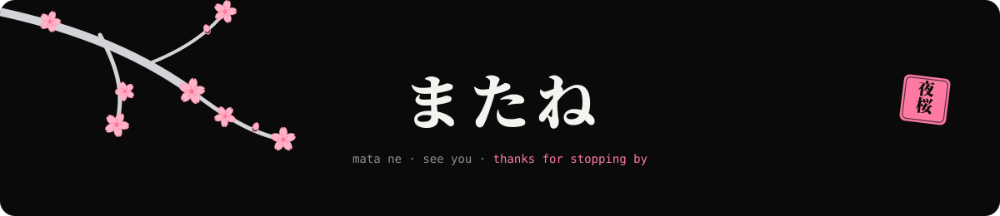</picture>

Every image here is an SVG drawn by [`scripts/build.py`](scripts/build.py); stats and the snake are redrawn daily by
[a workflow](.github/workflows/profile.yml). Source: [van1dalgrr-arch/van1dalgrr-arch](https://github.com/van1dalgrr-arch/van1dalgrr-arch).
